# Task A:
## Component 1 - Clearing Unwanted Blocks
**Test 1**: Clear All Blocks of Various Types From The Village
**Description**: To test that all blocks deemed "unwanted" and could make plots rejected if remain, are removed from the village.

**Setup**: Go to MakeFile for component 1 task A
Arguments: seed = 42, --testmode
Command to run: ./test_taskA_component1 --testmode --seed=42 < Tests/task_a_tests/task_a_component1_clearblocks.input

    "oak_leaves", "dark_oak_leaves", "birch_leaves", 
    "spruce_leaves", "jungle_leaves", "acacia_leaves",
    "mangrove_leaves", "azalea_leaves", "flowering_azalea_leaves",
    "oak_log", "dark_oak_log", "birch_log",
    "spruce_log", "jungle_log", "acacia_log",
    "mangrove_log", "azalea", "flowering_azalea",
    "vine", "bamboo", "mushroom_stem",
    "cactus", "dead_bush", "red_mushroom_block",
    "brown_mushroom_block", "grass", "tall_grass",
    "allium", "azure_bluet", "blue_orchid",
    "cornflower", "dandelion", "lilac",
    "lily_of_the_valley", "oxeye_daisy",
    "peony", "poppy", "rose_bush",
    "sunflower", "orange_tulip", "red_tulip", "white_tulip", "pink_tulip",
    "wither_rose", "melon", "pumpkin"
**Screenshot**:
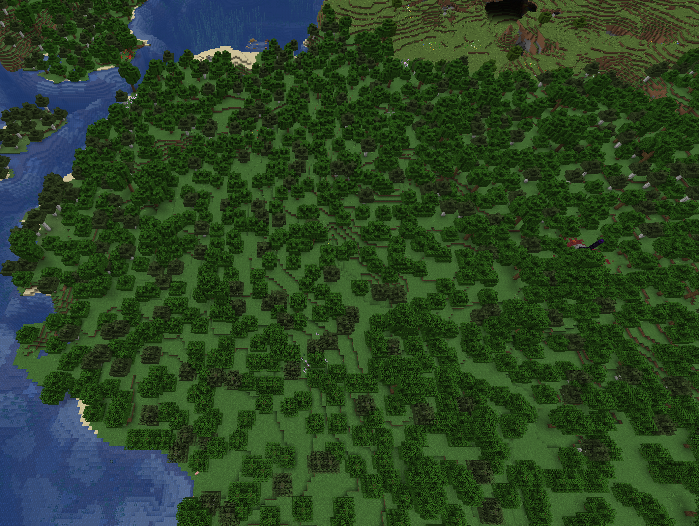
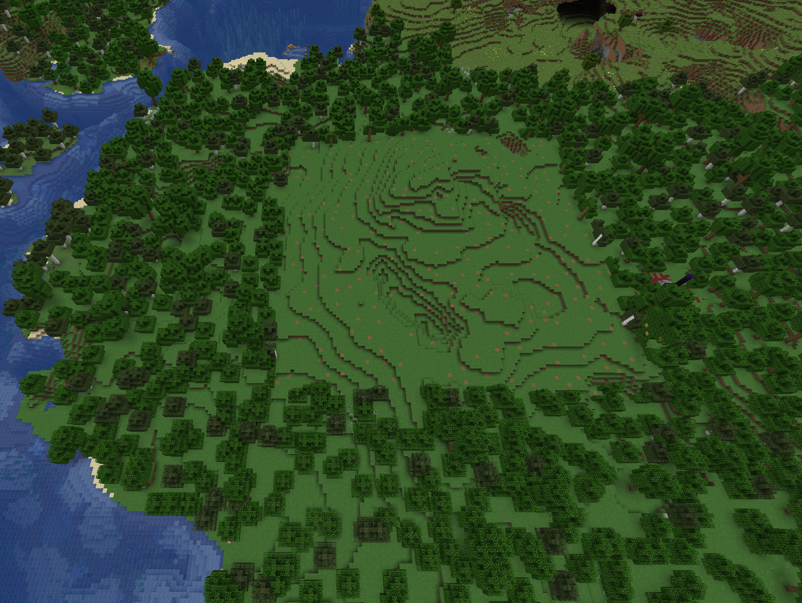

**Expected Output**:
COMPONENT 1: CLEAR UNWANTED BLOCKS
Seed is 42

Village bounds: (270, 172) to (370, 272)
  [CLEARING TREES] Using /fill command...
  [CLEARED 147 chunks]

**Why This Test Passes**:
It does replace all of the above mentioned blocks with air, effectively clearing them.

# Task A:
## Component 2 - Testing Plots for Validity
**Test 2**: Clear All Blocks of Various Types From The Village
**Description**: To test that all blocks deemed "unwanted" and could make plots rejected if remain, are removed from the village.

**Setup**: Go to MakeFile for component 2 task A
Arguments: seed = 42, --testmode
Command to run: ./test_taskA_component2 --testmode --seed=42 < Tests/task_a_tests/task_a_component2_plotvalidity.input

**Expected Output**:
COMPONENT 2: GET PLOTS
Seed is 42

Village bounds: (270, 172) to (370, 272)
  [CLEARING TREES] Using /fill command...
  [CLEARED 147 chunks]
         Finding plots...
  [VALIDATION START] Checking 14x14 plot...
    Scanning row 0/14...
    Scanning row 5/14...
    Scanning row 10/14...
  [TERRAIN DONE] minY=65, maxY=68, water=0
  [CHECKING BORDER]...
  [BORDER OK, CHECKING INTERSECTIONS]
  [ACCEPTED] VALID PLOT!
Plot 1 found at (275, 68, 177) with size 14x14
  [VALIDATION START] Checking 15x15 plot...
    Scanning row 0/15...
    Scanning row 5/15...
    Scanning row 10/15...
  [TERRAIN DONE] minY=66, maxY=69, water=0
  [CHECKING BORDER]...
  [BORDER OK, CHECKING INTERSECTIONS]
  [REJECTED] Plot intersection
  [VALIDATION START] Checking 15x15 plot...
    Scanning row 0/15...
    Scanning row 5/15...
    Scanning row 10/15...
  [TERRAIN DONE] minY=66, maxY=69, water=0
  [CHECKING BORDER]...
  [BORDER OK, CHECKING INTERSECTIONS]
  [REJECTED] Plot intersection
  [VALIDATION START] Checking 15x15 plot...
    Scanning row 0/15...
    Scanning row 5/15...
    Scanning row 10/15...
  [TERRAIN DONE] minY=67, maxY=69, water=0
  [CHECKING BORDER]...
  [BORDER OK, CHECKING INTERSECTIONS]
  [ACCEPTED] VALID PLOT!
Plot 2 found at (290, 69, 177) with size 15x15

**Why This Test Passes**:
It finds valid plots based on the conditions.

# Task A:
## Component 3 - Terraforming the chosen plots
**Test 3**: Clear All Blocks of Various Types From The Village
**Description**: To test that all blocks deemed "unwanted" and could make plots rejected if remain, are removed from the village.

**Setup**: Go to MakeFile for component 3 task A
Arguments: seed = 42, --testmode
Command to run: ./test_taskA_component3 --testmode --seed=42 < Tests/task_a_tests/task_a_component3_terraform.input
**Screenshot**:
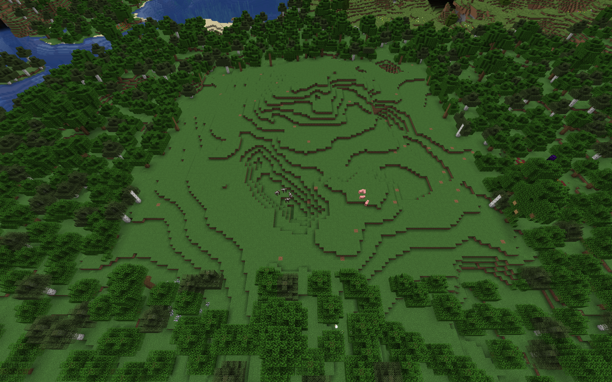
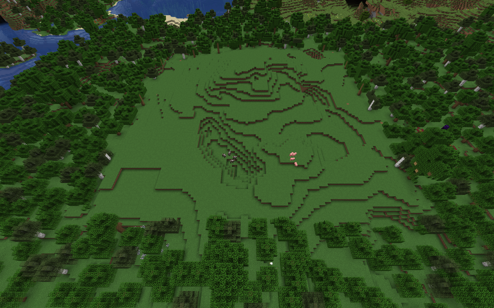

**Expected Output**:
COMPONENT 3: TERRAFORM
Seed is 42

Village bounds: (270, 172) to (370, 272)
  [CLEARING TREES] Using /fill command...
  [CLEARED 147 chunks]
         Finding plots...
  [VALIDATION START] Checking 14x14 plot...
    Scanning row 0/14...
    Scanning row 5/14...
    Scanning row 10/14...
  [TERRAIN DONE] minY=65, maxY=68, water=0
  [CHECKING BORDER]...
  [BORDER OK, CHECKING INTERSECTIONS]
  [ACCEPTED] VALID PLOT!
Plot 1 found at (275, 68, 177) with size 14x14
  [VALIDATION START] Checking 15x15 plot...
    Scanning row 0/15...
    Scanning row 5/15...
    Scanning row 10/15...
  [TERRAIN DONE] minY=66, maxY=69, water=0
  [CHECKING BORDER]...
  [BORDER OK, CHECKING INTERSECTIONS]
  [REJECTED] Plot intersection
  [VALIDATION START] Checking 15x15 plot...
    Scanning row 0/15...
    Scanning row 5/15...
    Scanning row 10/15...
  [TERRAIN DONE] minY=66, maxY=69, water=0
  [CHECKING BORDER]...
  [BORDER OK, CHECKING INTERSECTIONS]
  [REJECTED] Plot intersection
  [VALIDATION START] Checking 15x15 plot...
    Scanning row 0/15...
    Scanning row 5/15...
    Scanning row 10/15...
  [TERRAIN DONE] minY=67, maxY=69, water=0
  [CHECKING BORDER]...
  [BORDER OK, CHECKING INTERSECTIONS]
  [ACCEPTED] VALID PLOT!
Plot 2 found at (290, 69, 177) with size 15x15
         Doing some landscaping...
  [TERRAFORMING] Processing 1021 columns...
  [TERRAFORMING COMPLETE]
  [TERRAFORMING] Processing 1099 columns...
  [TERRAFORMING COMPLETE]

**Why This Test Passes**:
It flattens the plot area for the houses to be built upon.

# Task A:
## Component 4 - Placing Wall Around The Village
**Test 4**: Placing a wall around the village
**Description**: To test that the wall is around the village

**Setup**: Go to MakeFile for component 4 task A
Arguments: seed = 42, --testmode
Command to run: ./test_taskA_component4 --testmode --seed=42 < Tests/task_a_tests/task_a_component4_wall.input
**Screenshot**:
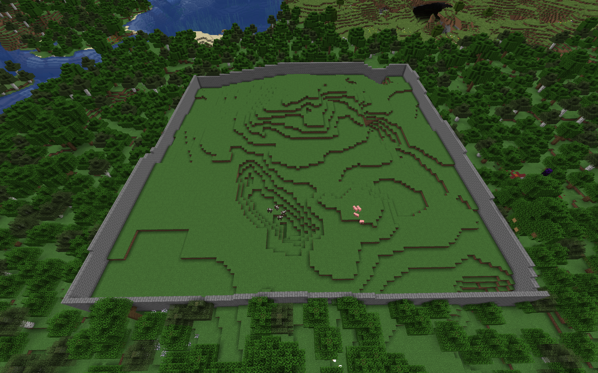
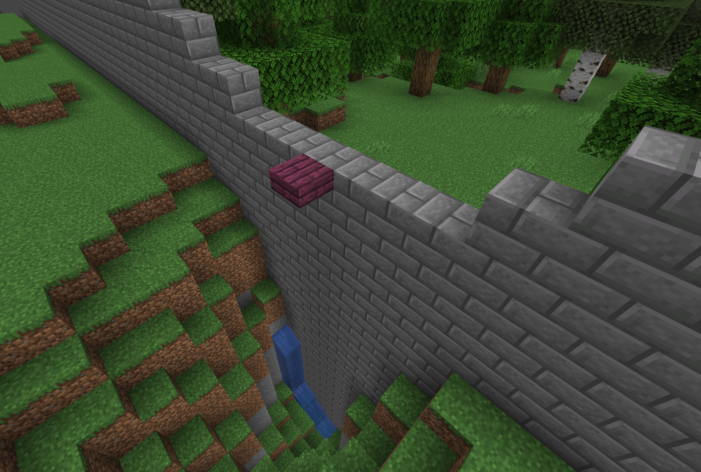

**Expected Output**:
COMPONENT 4: PLACE WALLS
Seed is 42

Village bounds: (270, 172) to (370, 272)
  [CLEARING TREES] Using /fill command...
  [CLEARED 147 chunks]
         Finding plots...
  [VALIDATION START] Checking 14x14 plot...
    Scanning row 0/14...
    Scanning row 5/14...
    Scanning row 10/14...
  [TERRAIN DONE] minY=68, maxY=68, water=0
  [CHECKING BORDER]...
  [BORDER OK, CHECKING INTERSECTIONS]
  [ACCEPTED] VALID PLOT!
Plot 1 found at (275, 68, 177) with size 14x14
  [VALIDATION START] Checking 15x15 plot...
    Scanning row 0/15...
    Scanning row 5/15...
    Scanning row 10/15...
  [TERRAIN DONE] minY=68, maxY=69, water=0
  [CHECKING BORDER]...
  [BORDER OK, CHECKING INTERSECTIONS]
  [REJECTED] Plot intersection
  [VALIDATION START] Checking 15x15 plot...
    Scanning row 0/15...
    Scanning row 5/15...
    Scanning row 10/15...
  [TERRAIN DONE] minY=68, maxY=69, water=0
  [CHECKING BORDER]...
  [BORDER OK, CHECKING INTERSECTIONS]
  [REJECTED] Plot intersection
  [VALIDATION START] Checking 15x15 plot...
    Scanning row 0/15...
    Scanning row 5/15...
    Scanning row 10/15...
  [TERRAIN DONE] minY=69, maxY=69, water=0
  [CHECKING BORDER]...
  [BORDER OK, CHECKING INTERSECTIONS]
  [ACCEPTED] VALID PLOT!
Plot 2 found at (290, 69, 177) with size 15x15
         Doing some landscaping...
  [TERRAFORMING] Processing 706 columns...
  [TERRAFORMING COMPLETE]
  [TERRAFORMING] Processing 924 columns...
  [TERRAFORMING COMPLETE]
         Placing a cool wall around the village...
Building village wall...
  Building north wall...
  Building south wall...
  Building west wall...
  Building east wall...
Village wall complete!

**Why This Test Passes**:
The walls go around the village. They cross pits, they also go 7 blocks underwater to pervent possible swimming under.

# Task A:
## Component 5 - Waypoint Generation
**Test 4**: Generating waypoints
**Description**: To test that the waypoints for the paths are generated

**Setup**: Go to MakeFile for component 5 task A
Arguments: seed = 42, --testmode
Command to run: ./test_taskA_component5 --testmode --seed=42 < Tests/task_a_tests/task_a_component5_waypoints.input

**Expected Output**:
COMPONENT 5: GET WAYPOINTS
Seed is 42

Village bounds: (270, 172) to (370, 272)
  [CLEARING TREES] Using /fill command...
  [CLEARED 147 chunks]
         Finding plots...
  [VALIDATION START] Checking 14x14 plot...
    Scanning row 0/14...
    Scanning row 5/14...
    Scanning row 10/14...
  [TERRAIN DONE] minY=65, maxY=68, water=0
  [CHECKING BORDER]...
  [BORDER OK, CHECKING INTERSECTIONS]
  [ACCEPTED] VALID PLOT!
Plot 1 found at (275, 68, 177) with size 14x14
  [VALIDATION START] Checking 15x15 plot...
    Scanning row 0/15...
    Scanning row 5/15...
    Scanning row 10/15...
  [TERRAIN DONE] minY=66, maxY=69, water=0
  [CHECKING BORDER]...
  [BORDER OK, CHECKING INTERSECTIONS]
  [REJECTED] Plot intersection
  [VALIDATION START] Checking 15x15 plot...
    Scanning row 0/15...
    Scanning row 5/15...
    Scanning row 10/15...
  [TERRAIN DONE] minY=66, maxY=69, water=0
  [CHECKING BORDER]...
  [BORDER OK, CHECKING INTERSECTIONS]
  [REJECTED] Plot intersection
  [VALIDATION START] Checking 15x15 plot...
    Scanning row 0/15...
    Scanning row 5/15...
    Scanning row 10/15...
  [TERRAIN DONE] minY=67, maxY=69, water=0
  [CHECKING BORDER]...
  [BORDER OK, CHECKING INTERSECTIONS]
  [ACCEPTED] VALID PLOT!
Plot 2 found at (290, 69, 177) with size 15x15
         Doing some landscaping...
  [TERRAFORMING] Processing 706 columns...
  [TERRAFORMING COMPLETE]
  [TERRAFORMING] Processing 924 columns...
  [TERRAFORMING COMPLETE]
         Placing a cool wall around the village...
Building village wall...
  Building north wall...
  Building south wall...
  Building west wall...
  Building east wall...
Village wall complete!
         Finding waypoints...
Finding waypoints...
Village boundaries: X[270 to 370], Z[172 to 272]
Pathfinding safe zone: X[275 to 365], Z[177 to 267]
Finding waypoint for plot 0 at (281, 183)...
Testing position (298, 200) - dist to center: 31.1127
Valid position!
Waypoint placed at (298, 70, 200) - distance to center: 31.1127
Testing position (297, 199) - dist to center: 32.5269
Testing position (296, 198) - dist to center: 33.9411
Testing position (295, 197) - dist to center: 35.3553
Testing position (294, 196) - dist to center: 36.7696
Testing position (293, 195) - dist to center: 38.1838
Testing position (292, 194) - dist to center: 39.598
Testing position (291, 193) - dist to center: 41.0122
Testing position (290, 192) - dist to center: 42.4264
Testing position (298, 183) - dist to center: 44.7772
Testing position (281, 200) - dist to center: 44.7772
Testing position (281, 199) - dist to center: 45.2769
Testing position (297, 183) - dist to center: 45.2769
Testing position (296, 183) - dist to center: 45.793
Testing position (281, 198) - dist to center: 45.793
Testing position (281, 197) - dist to center: 46.3249
Testing position (295, 183) - dist to center: 46.3249
Testing position (281, 196) - dist to center: 46.8722
Testing position (294, 183) - dist to center: 46.8722
Testing position (281, 195) - dist to center: 47.4342
Testing position (293, 183) - dist to center: 47.4342
Testing position (292, 183) - dist to center: 48.0104
Testing position (281, 194) - dist to center: 48.0104
Testing position (281, 193) - dist to center: 48.6004
Testing position (291, 183) - dist to center: 48.6004
Testing position (290, 183) - dist to center: 49.2037
Testing position (281, 192) - dist to center: 49.2037
Testing position (290, 175) - dist to center: 55.7584
Testing position (273, 192) - dist to center: 55.7584
Testing position (272, 193) - dist to center: 56.0803
Testing position (291, 174) - dist to center: 56.0803
Testing position (292, 173) - dist to center: 56.4358
Testing position (271, 194) - dist to center: 56.4358
Testing position (270, 195) - dist to center: 56.8243
Testing position (293, 172) - dist to center: 56.8243
Testing position (269, 196) - dist to center: 57.2451
Testing position (294, 171) - dist to center: 57.2451
Testing position (268, 197) - dist to center: 57.6975
Testing position (295, 170) - dist to center: 57.6975
Testing position (267, 198) - dist to center: 58.1808
Testing position (296, 169) - dist to center: 58.1808
Testing position (297, 168) - dist to center: 58.6941
Testing position (266, 199) - dist to center: 58.6941
Testing position (265, 200) - dist to center: 59.2368
Testing position (298, 167) - dist to center: 59.2368
Testing position (281, 175) - dist to center: 61.0737
Testing position (273, 183) - dist to center: 61.0737
Testing position (281, 174) - dist to center: 61.8466
Testing position (272, 183) - dist to center: 61.8466
Testing position (271, 183) - dist to center: 62.6259
Testing position (281, 173) - dist to center: 62.6259
Testing position (270, 183) - dist to center: 63.4114
Testing position (281, 172) - dist to center: 63.4114
Testing position (269, 183) - dist to center: 64.2028
Testing position (281, 171) - dist to center: 64.2028
Testing position (268, 183) - dist to center: 65
Testing position (281, 170) - dist to center: 65
Testing position (281, 169) - dist to center: 65.8027
Testing position (267, 183) - dist to center: 65.8027
Testing position (273, 175) - dist to center: 66.468
Testing position (281, 168) - dist to center: 66.6108
Testing position (266, 183) - dist to center: 66.6108
Testing position (265, 183) - dist to center: 67.424
Testing position (281, 167) - dist to center: 67.424
Testing position (272, 174) - dist to center: 67.8823
Testing position (271, 173) - dist to center: 69.2965
Testing position (270, 172) - dist to center: 70.7107
Testing position (269, 171) - dist to center: 72.1249
Testing position (268, 170) - dist to center: 73.5391
Testing position (267, 169) - dist to center: 74.9533
Testing position (266, 168) - dist to center: 76.3675
Testing position (265, 167) - dist to center: 77.7817
Finding waypoint for plot 1 at (297, 184)...
Testing position (314, 201) - dist to center: 21.8403
Valid position!
Waypoint placed at (314, 70, 201) - distance to center: 21.8403
Testing position (313, 200) - dist to center: 23.0868
Testing position (312, 199) - dist to center: 24.3516
Testing position (311, 198) - dist to center: 25.632
Testing position (310, 197) - dist to center: 26.9258
Testing position (309, 196) - dist to center: 28.2312
Testing position (308, 195) - dist to center: 29.5466
Testing position (307, 194) - dist to center: 30.8707
Testing position (297, 201) - dist to center: 31.1448
Testing position (297, 200) - dist to center: 31.8277
Testing position (306, 193) - dist to center: 32.2025
Testing position (297, 199) - dist to center: 32.5269
Testing position (297, 198) - dist to center: 33.2415
Testing position (297, 197) - dist to center: 33.9706
Testing position (297, 196) - dist to center: 34.7131
Testing position (297, 195) - dist to center: 35.4683
Testing position (297, 194) - dist to center: 36.2353
Testing position (297, 193) - dist to center: 37.0135
Testing position (314, 184) - dist to center: 38.4708
Testing position (313, 184) - dist to center: 38.6394
Testing position (312, 184) - dist to center: 38.833
Testing position (311, 184) - dist to center: 39.0512
Testing position (310, 184) - dist to center: 39.2938
Testing position (309, 184) - dist to center: 39.5601
Testing position (308, 184) - dist to center: 39.8497
Testing position (307, 184) - dist to center: 40.1622
Testing position (306, 184) - dist to center: 40.4969
Testing position (288, 193) - dist to center: 43.1856
Testing position (287, 194) - dist to center: 43.2782
Testing position (286, 195) - dist to center: 43.4166
Testing position (285, 196) - dist to center: 43.6005
Testing position (284, 197) - dist to center: 43.8292
Testing position (283, 198) - dist to center: 44.1022
Testing position (282, 199) - dist to center: 44.4185
Testing position (281, 200) - dist to center: 44.7772
Testing position (280, 201) - dist to center: 45.1774
Testing position (306, 175) - dist to center: 49.0408
Testing position (288, 184) - dist to center: 49.679
Testing position (307, 174) - dist to center: 49.7293
Testing position (287, 184) - dist to center: 50.3289
Testing position (308, 173) - dist to center: 50.448
Testing position (286, 184) - dist to center: 50.9902
Testing position (309, 172) - dist to center: 51.1957
Testing position (285, 184) - dist to center: 51.6624
Testing position (310, 171) - dist to center: 51.9711
Testing position (297, 175) - dist to center: 52.3259
Testing position (284, 184) - dist to center: 52.345
Testing position (311, 170) - dist to center: 52.7731
Testing position (283, 184) - dist to center: 53.0377
Testing position (297, 174) - dist to center: 53.2259
Testing position (312, 169) - dist to center: 53.6004
Testing position (282, 184) - dist to center: 53.7401
Testing position (297, 173) - dist to center: 54.1295
Testing position (313, 168) - dist to center: 54.4518
Testing position (281, 184) - dist to center: 54.4518
Testing position (297, 172) - dist to center: 55.0364
Testing position (280, 184) - dist to center: 55.1725
Testing position (314, 167) - dist to center: 55.3263
Testing position (297, 171) - dist to center: 55.9464
Testing position (288, 175) - dist to center: 56.8595
Testing position (297, 170) - dist to center: 56.8595
Testing position (297, 169) - dist to center: 57.7754
Testing position (287, 174) - dist to center: 58.2495
Testing position (297, 168) - dist to center: 58.6941
Testing position (297, 167) - dist to center: 59.6154
Testing position (286, 173) - dist to center: 59.6406
Testing position (285, 172) - dist to center: 61.0328
Testing position (284, 171) - dist to center: 62.426
Testing position (283, 170) - dist to center: 63.8201
Testing position (282, 169) - dist to center: 65.215
Testing position (281, 168) - dist to center: 66.6108
Testing position (280, 167) - dist to center: 68.0074
Finding central waypoint...
Testing center position (320, 222)
Valid position!
Center waypoint at (320, 72, 222)

========================================
Generated 3 total waypoints
========================================

**Why This Test Passes**:
The waypoints are generated correctly.

# Task A - Edge Case:
## Edge Case 1 - No Unwanted Blocks Present At All
**Test 1**: No unwanted blocks present in the village
**Description**:  Test that the clearing component handles a village with no unwanted blocks gracefully, without errors.
**Setup**: Go to MakeFile for component 1 task A (Same to test the edge case)
Arguments: seed = 42, --testmode
Command to run: ./test_taskA_edge1 --testmode --seed=42 < Tests/task_a_tests/task_a_edge1_clearnothing.input
Should be run where there is no blocks in the to-clear list
**Expected Output**:
EDGE CASE 1: NO BLOCKS TO CLEAR
Seed is 42

Village bounds: (270, 172) to (370, 272)
  [CLEARING TREES] Using /fill command...
  [CLEARED 147 chunks]
**Why This Test Passes**:
The chunks are still cleared as normal, with no errors, even if there are no blocks to clear.

# Task A - Edge Case:
## Edge Case 2 - Terraforming On Flat Land (Which Is Not Needed)
**Test 1**: Completely flat land in a flat world
**Description**:  Test that the flat lands remain flat.
**Setup**: Go to MakeFile for component 1 task A (Same to test the edge case)
Arguments: seed = 42, --testmode
Command to run: ./test_taskA_edge2 --testmode --seed=42 < Tests/task_a_tests/task_a_edge2_flatlands.input
Program ran at at x = 320, z = 222 so player should be near to observe
**Expected Output**:
EDGE CASE 2: FLAT LANDS
Seed is 42

Village bounds: (270, 172) to (370, 272)
  [CLEARING TREES] Using /fill command...
  [CLEARED 147 chunks]
         Finding plots...
  [VALIDATION START] Checking 14x14 plot...
    Scanning row 0/14...
    Scanning row 5/14...
    Scanning row 10/14...
  [TERRAIN DONE] minY=-61, maxY=-61, water=0
  [CHECKING BORDER]...
  [BORDER OK, CHECKING INTERSECTIONS]
  [ACCEPTED] VALID PLOT!
Plot 1 found at (275, -61, 177) with size 14x14
  [VALIDATION START] Checking 15x15 plot...
    Scanning row 0/15...
    Scanning row 5/15...
    Scanning row 10/15...
  [TERRAIN DONE] minY=-61, maxY=-61, water=0
  [CHECKING BORDER]...
  [BORDER OK, CHECKING INTERSECTIONS]
  [REJECTED] Plot intersection
  [VALIDATION START] Checking 15x15 plot...
    Scanning row 0/15...
    Scanning row 5/15...
    Scanning row 10/15...
  [TERRAIN DONE] minY=-61, maxY=-61, water=0
  [CHECKING BORDER]...
  [BORDER OK, CHECKING INTERSECTIONS]
  [REJECTED] Plot intersection
  [VALIDATION START] Checking 15x15 plot...
    Scanning row 0/15...
    Scanning row 5/15...
    Scanning row 10/15...
  [TERRAIN DONE] minY=-61, maxY=-61, water=0
  [CHECKING BORDER]...
  [BORDER OK, CHECKING INTERSECTIONS]
  [ACCEPTED] VALID PLOT!
Plot 2 found at (290, -61, 177) with size 15x15
         Doing some landscaping...
  [TERRAFORMING] Processing 706 columns...
  [TERRAFORMING COMPLETE]
  [TERRAFORMING] Processing 924 columns...
  [TERRAFORMING COMPLETE]
**Why This Test Passes**:
No lands have been terraformed.

# Task B:
## Component 1 - Building Exterior
**Test 1**: Basic House Construction and Height Increase
**Description**:  To test that houses are built with walls, a roof, and correct height increments in testmode. Height of the walls should increase by 1 for every plot.

**Setup**: Go to MakeFile for component 1 task B
Arguments: seed = 42, --testmode
Command to run: ./test_component1 --testmode --seed=42 < Tests/task_b_component1_basic.input
should be within superflat terrain, to ensure no environmental disruptions. Location to view is around (100, -60 100).
**Screenshot**:
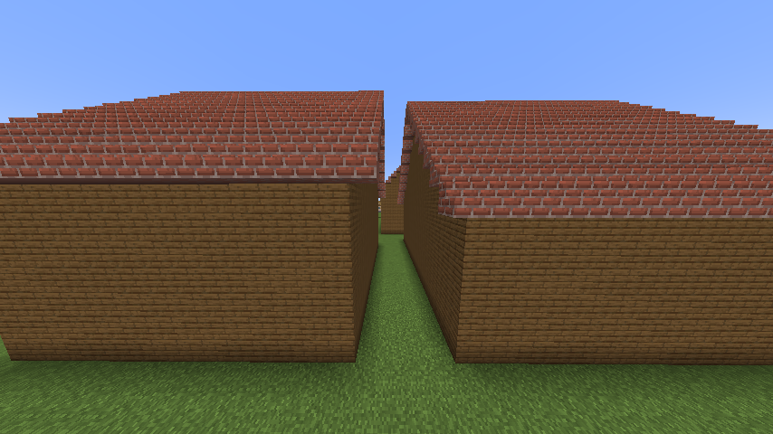
.png)

**Expected Output**: 
COMPONENT 1: BUILDING EXTERIOR
Seed is 42

Total plots: 4
Total waypoints: 5

========================================
Preparing Block Cache
========================================
  [CACHE] Initialising block cache...
  [CACHE] Area: (1027, -61, 1274) to (1158, -59, 1417)
  [CACHE] Allocating 3D array: 132x3x144 = 57024 blocks
  [CACHE] Fetching blocks in bulk... Done!
  [CACHE] Populating cache array... Done!
  [CACHE] Cache ready with 57024 blocks!
Cache ready!


========================================
Starting Task C: PathFinding
========================================

Step 1: Connecting waypoints...
Connecting 5 waypoints
  Waypoint 0 at (1064,-60,1359) - VALID
  Waypoint 1 at (1112,-60,1346) - VALID
  Waypoint 2 at (1071,-60,1318) - VALID
  Waypoint 3 at (1060,-60,1373) - VALID
  Waypoint 4 at (1067,-60,1340) - VALID
Connecting Waypoints 0 to 3
Finding path from (1064,-60,1359) to (1060,-60,1373)
  Start valid? Yes
  Goal valid? Yes
  Starting Bidirectional BFS loop...
  Iteration 1 | Forward: 1 | Backward: 1
  Iteration 2 | Forward: 4 | Backward: 4
  Iteration 3 | Forward: 6 | Backward: 6
  Iteration 4 | Forward: 8 | Backward: 8
  Iteration 5 | Forward: 8 | Backward: 8
  Iteration 6 | Forward: 8 | Backward: 8
  Iteration 7 | Forward: 10 | Backward: 10
  Iteration 8 | Forward: 10 | Backward: 10
  Iteration 9 | Forward: 10 | Backward: 10
  Iteration 10 | Forward: 12 | Backward: 12
  Iteration 100 | Forward: 32 | Backward: 32
  Paths met at (1064,-60,1368)!
  BFS ended after 156 iterations
  Path found with 19 steps
Connecting Waypoints 0 to 4
Finding path from (1064,-60,1359) to (1067,-60,1340)
  Start valid? Yes
  Goal valid? Yes
  Starting Bidirectional BFS loop...
  Iteration 1 | Forward: 1 | Backward: 1
  Iteration 2 | Forward: 4 | Backward: 4
  Iteration 3 | Forward: 6 | Backward: 6
  Iteration 4 | Forward: 8 | Backward: 8
  Iteration 5 | Forward: 8 | Backward: 8
  Iteration 6 | Forward: 8 | Backward: 8
  Iteration 7 | Forward: 10 | Backward: 10
  Iteration 8 | Forward: 10 | Backward: 10
  Iteration 9 | Forward: 10 | Backward: 10
  Iteration 10 | Forward: 12 | Backward: 12
  Iteration 100 | Forward: 32 | Backward: 32
  Iteration 200 | Forward: 42 | Backward: 42
  Paths met at (1067, -60, 1351)!
  BFS ended after 238 iterations
  Path found with 23 steps
Connecting Waypoints 4 to 2
Finding path from (1067,-60,1340) to (1071,-60,1318)
  Start valid? Yes
  Goal valid? Yes
  Starting Bidirectional BFS loop...
  Iteration 1 | Forward: 1 | Backward: 1
  Iteration 2 | Forward: 4 | Backward: 4
  Iteration 3 | Forward: 6 | Backward: 6
  Iteration 4 | Forward: 8 | Backward: 8
  Iteration 5 | Forward: 8 | Backward: 8
  Iteration 6 | Forward: 8 | Backward: 8
  Iteration 7 | Forward: 10 | Backward: 10
  Iteration 8 | Forward: 10 | Backward: 10
  Iteration 9 | Forward: 10 | Backward: 10
  Iteration 10 | Forward: 12 | Backward: 12
  Iteration 100 | Forward: 32 | Backward: 32
  Iteration 200 | Forward: 42 | Backward: 42
  Iteration 300 | Forward: 52 | Backward: 52
  Paths met at (1071, -60, 1331)!
  BFS ended after 332 iterations
  Path found with 27 steps
Connecting Waypoints 4 to 1
Finding path from (1067,-60,1340) to (1112,-60,1346)
  Start valid? Yes
  Goal valid? Yes
  Starting Bidirectional BFS loop...
  Iteration 1 | Forward: 1 | Backward: 1
  Iteration 2 | Forward: 4 | Backward: 4
  Iteration 3 | Forward: 6 | Backward: 6
  Iteration 4 | Forward: 8 | Backward: 8
  Iteration 5 | Forward: 8 | Backward: 8
  Iteration 6 | Forward: 8 | Backward: 8
  Iteration 7 | Forward: 10 | Backward: 10
  Iteration 8 | Forward: 10 | Backward: 10
  Iteration 9 | Forward: 10 | Backward: 10
  Iteration 10 | Forward: 12 | Backward: 12
  Iteration 100 | Forward: 32 | Backward: 32
  Iteration 200 | Forward: 42 | Backward: 42
  Iteration 300 | Forward: 52 | Backward: 52
  Iteration 400 | Forward: 60 | Backward: 59
  Iteration 500 | Forward: 66 | Backward: 61
  Iteration 600 | Forward: 72 | Backward: 66
  Iteration 700 | Forward: 78 | Backward: 71
  Iteration 800 | Forward: 82 | Backward: 76
  Iteration 900 | Forward: 88 | Backward: 82
  Iteration 1000 | Forward: 92 | Backward: 86
  Iteration 1100 | Forward: 96 | Backward: 92
  Iteration 1200 | Forward: 100 | Backward: 96
  Paths met at (1092, -60, 1340)!
  BFS ended after 1202 iterations
  Path found with 52 steps
  Building path with 19 segments...
  Path built!
  Building path with 23 segments...
  Path built!
  Building path with 27 segments...
  Path built!
  Building path with 52 segments...
  Path built!
Waypoints connected and Path build!

Step 2: Connecting houses to waypoints...
Connecting house 0 to nearest waypoint...
  House entrance at (1087,71,1369)
  Start point (2 blocks from entrance): (1087,-60,1369)
  Connecting to waypoint 0 at (1064,-60,1359)
Finding path from (1087,-60,1369) to (1064,-60,1359)
  Start valid? Yes
  Goal valid? Yes
  Starting Bidirectional BFS loop...
  Iteration 1 | Forward: 1 | Backward: 1
  Iteration 2 | Forward: 4 | Backward: 4
  Iteration 3 | Forward: 6 | Backward: 6
  Iteration 4 | Forward: 8 | Backward: 8
  Iteration 5 | Forward: 8 | Backward: 8
  Iteration 6 | Forward: 8 | Backward: 8
  Iteration 7 | Forward: 10 | Backward: 10
  Iteration 8 | Forward: 10 | Backward: 10
  Iteration 9 | Forward: 10 | Backward: 10
  Iteration 10 | Forward: 12 | Backward: 12
  Iteration 100 | Forward: 32 | Backward: 32
  Iteration 200 | Forward: 40 | Backward: 42
  Iteration 300 | Forward: 47 | Backward: 52
  Iteration 400 | Forward: 57 | Backward: 60
  Paths met at (1077, -60, 1363)!
  BFS ended after 489 iterations
  Path found with 34 steps
  Building path with 34 segments...
  Path built!
  ✓ Path built successfully!
Connecting house 1 to nearest waypoint...
  House entrance at (1122,66,1352)
  Start point (2 blocks from entrance): (1122,-60,1352)
  Connecting to waypoint 1 at (1112,-60,1346)
Finding path from (1122,-60,1352) to (1112,-60,1346)
  Start valid? Yes
  Goal valid? Yes
  Starting Bidirectional BFS loop...
  Iteration 1 | Forward: 1 | Backward: 1
  Iteration 2 | Forward: 4 | Backward: 4
  Iteration 3 | Forward: 6 | Backward: 6
  Iteration 4 | Forward: 8 | Backward: 8
  Iteration 5 | Forward: 8 | Backward: 8
  Iteration 6 | Forward: 8 | Backward: 8
  Iteration 7 | Forward: 10 | Backward: 10
  Iteration 8 | Forward: 10 | Backward: 10
  Iteration 9 | Forward: 10 | Backward: 10
  Iteration 10 | Forward: 12 | Backward: 12
  Iteration 100 | Forward: 32 | Backward: 32
  Paths met at (1120,-60,1346)!
  BFS ended after 114 iterations
  Path found with 17 steps
  Building path with 17 segments...
  Path built!
  ✓ Path built successfully!
Connecting house 2 to nearest waypoint...
  House entrance at (1059,65,1308)
  Start point (2 blocks from entrance): (1059,-60,1308)
  Connecting to waypoint 2 at (1071,-60,1318)
Finding path from (1059,-60,1308) to (1071,-60,1318)
  Start valid? Yes
  Goal valid? Yes
  Starting Bidirectional BFS loop...
  Iteration 1 | Forward: 1 | Backward: 1
  Iteration 2 | Forward: 4 | Backward: 4
  Iteration 3 | Forward: 6 | Backward: 6
  Iteration 4 | Forward: 8 | Backward: 8
  Iteration 5 | Forward: 8 | Backward: 8
  Iteration 6 | Forward: 8 | Backward: 8
  Iteration 7 | Forward: 10 | Backward: 10
  Iteration 8 | Forward: 10 | Backward: 10
  Iteration 9 | Forward: 10 | Backward: 10
  Iteration 10 | Forward: 12 | Backward: 12
  Iteration 100 | Forward: 32 | Backward: 32
  Iteration 200 | Forward: 41 | Backward: 42
  Paths met at (1069, -60, 1309)!
  BFS ended after 218 iterations
  Path found with 23 steps
  Building path with 23 segments...
  Path built!
  ✓ Path built successfully!
Connecting house 3 to nearest waypoint...
  House entrance at (1065,70,1383)
  Start point (2 blocks from entrance): (1065,-60,1383)
  Connecting to waypoint 3 at (1060,-60,1373)
Finding path from (1065,-60,1383) to (1060,-60,1373)
  Start valid? Yes
  Goal valid? Yes
  Starting Bidirectional BFS loop...
  Iteration 1 | Forward: 1 | Backward: 1
  Iteration 2 | Forward: 4 | Backward: 4
  Iteration 3 | Forward: 6 | Backward: 6
  Iteration 4 | Forward: 8 | Backward: 8
  Iteration 5 | Forward: 8 | Backward: 8
  Iteration 6 | Forward: 8 | Backward: 8
  Iteration 7 | Forward: 10 | Backward: 10
  Iteration 8 | Forward: 10 | Backward: 10
  Iteration 9 | Forward: 10 | Backward: 10
  Iteration 10 | Forward: 12 | Backward: 12
  Iteration 100 | Forward: 32 | Backward: 32
  Paths met at (1061, -60, 1380)!
  BFS ended after 105 iterations
  Path found with 16 steps
  Building path with 16 segments...
  Path built!
  ✓ Path built successfully!
Houses connected!

Step 3: Building waypoint structures(lamps)...

========================================
Task C Complete
========================================


========================================
TEST COMPLETE!
========================================

  ```

  **Why This Test Passes**: 
  -All waypoints are VALID and can be reached
  -Waypoints are connected using nearest-neighbor algorithm
  -All house entrances successfully connect to their nearest waypoint
  -House entrances use their original Y level directly, preventing height misalignment
  -House entrances are explicitly protected from being blocked by gravel
  -Gravel paths are 3 blocks wide
  -No bumps or height variations in the paths
  -Waypoint lamps (fence post + glowstone) are placed correctly

  ---

  # Task C:
  ## Component 2 - 3D_World
  **Test 2**: 3D World Road Generation
  **Description**: Testing the road generation function in a 3D world with natural terrain height variation, expecting paths to be built flat and level, connecting all waypoints together first by nearest-neighbor, then connecting house entrances to the nearest waypoint.

  **Setup**: Go to MakeFile for task C component 2 task 
  Arguments: seed = 42, --testmode 
  Should be in natural terrain with hills and valleys. Location to view is around (1067, 74, 1340).
  **Note**: The plot is bugy when I build them, but i still included house entrance in input file, hence my path will stop right before house entrance.

  **make** test_taskC_component2 
  **run** ./test_taskC_component2 --testmode --seed=42 < Tests/task_c_component2_3D_World.input > output2.txt

  diff output2.txt Tests/task_c_component2_3D_World.expout

  **Screenshot**:
  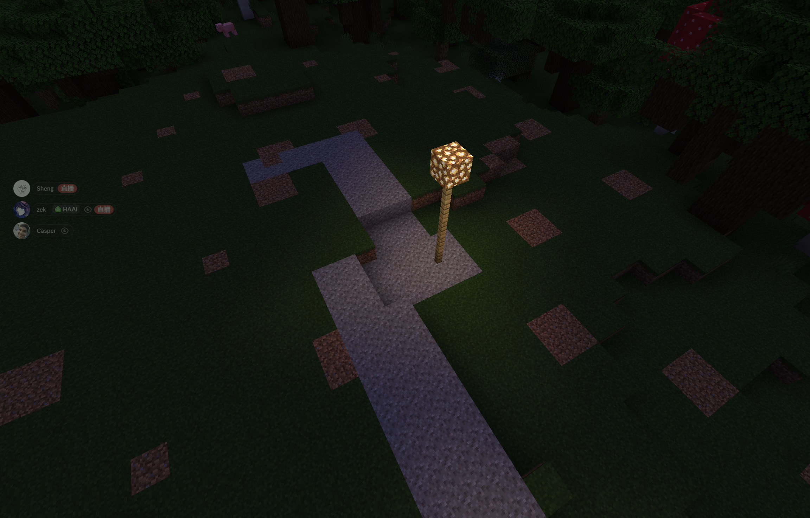
  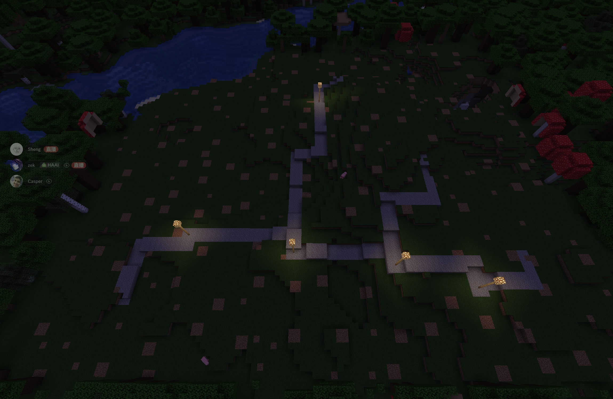

  **Expected Output**: 
  ```
  COMPONENT 2: 3D WORLD PATHFINDING
  Seed is 42

  Total plots: 4
  Total waypoints: 5

  ========================================
  Step 1: Clearing Obstacles
  ========================================
    [CLEARING TREES] Using /fill command...
    [CLEARED 126 chunks]
  Obstacles cleared!

  ========================================
  Step 2: Preparing Block Cache
  ========================================
    [CACHE] Initialising block cache...
    [CACHE] Area: (997, 57, 1244) to (1188, 79, 1447)
    [CACHE] Allocating 3D array: 192x23x204 = 900864 blocks
    [CACHE] Fetching blocks in bulk... Done!
    [CACHE] Populating cache array... Done!
    [CACHE] Cache ready with 900864 blocks!
  Cache ready!

  ========================================
  Step 3: Executing Pathfinding
  ========================================


  ========================================
  Starting Task C: PathFinding
  ========================================

  Step 1: Connecting waypoints...
  Connecting 5 waypoints
    Waypoint 0 at (1064,68,1359) - VALID
    Waypoint 1 at (1112,65,1346) - VALID
    Waypoint 2 at (1071,65,1318) - VALID
    Waypoint 3 at (1060,68,1373) - VALID
    Waypoint 4 at (1067,66,1340) - VALID
  Connecting Waypoints 0 to 3
  Finding path from (1064,68,1359) to (1060,68,1373)
    Start valid? Yes
    Goal valid? Yes
    Starting Bidirectional BFS loop...
    Iteration 1 | Forward: 1 | Backward: 1
    Iteration 2 | Forward: 4 | Backward: 4
    Iteration 3 | Forward: 6 | Backward: 6
    Iteration 4 | Forward: 8 | Backward: 8
    Iteration 5 | Forward: 8 | Backward: 8
    Iteration 6 | Forward: 8 | Backward: 8
    Iteration 7 | Forward: 10 | Backward: 10
    Iteration 8 | Forward: 10 | Backward: 10
    Iteration 9 | Forward: 10 | Backward: 10
    Iteration 10 | Forward: 12 | Backward: 12
    Iteration 100 | Forward: 32 | Backward: 32
    Paths met at (1064,69,1368)!
    BFS ended after 156 iterations
    Path found with 19 steps
  Connecting Waypoints 0 to 4
  Finding path from (1064,68,1359) to (1067,66,1340)
    Start valid? Yes
    Goal valid? Yes
    Starting Bidirectional BFS loop...
    Iteration 1 | Forward: 1 | Backward: 1
    Iteration 2 | Forward: 4 | Backward: 4
    Iteration 3 | Forward: 6 | Backward: 6
    Iteration 4 | Forward: 8 | Backward: 8
    Iteration 5 | Forward: 8 | Backward: 8
    Iteration 6 | Forward: 8 | Backward: 8
    Iteration 7 | Forward: 10 | Backward: 10
    Iteration 8 | Forward: 10 | Backward: 10
    Iteration 9 | Forward: 10 | Backward: 10
    Iteration 10 | Forward: 12 | Backward: 12
    Iteration 100 | Forward: 32 | Backward: 32
    Iteration 200 | Forward: 42 | Backward: 42
    Paths met at (1067, 66, 1351)!
    BFS ended after 238 iterations
    Path found with 23 steps
  Connecting Waypoints 4 to 2
  Finding path from (1067,66,1340) to (1071,65,1318)
    Start valid? Yes
    Goal valid? Yes
    Starting Bidirectional BFS loop...
    Iteration 1 | Forward: 1 | Backward: 1
    Iteration 2 | Forward: 4 | Backward: 4
    Iteration 3 | Forward: 6 | Backward: 6
    Iteration 4 | Forward: 8 | Backward: 8
    Iteration 5 | Forward: 8 | Backward: 8
    Iteration 6 | Forward: 8 | Backward: 8
    Iteration 7 | Forward: 10 | Backward: 10
    Iteration 8 | Forward: 10 | Backward: 10
    Iteration 9 | Forward: 10 | Backward: 10
    Iteration 10 | Forward: 12 | Backward: 12
    Iteration 100 | Forward: 32 | Backward: 32
    Iteration 200 | Forward: 42 | Backward: 42
    Iteration 300 | Forward: 52 | Backward: 52
    Paths met at (1071, 65, 1331)!
    BFS ended after 332 iterations
    Path found with 27 steps
  Connecting Waypoints 4 to 1
  Finding path from (1067,66,1340) to (1112,65,1346)
    Start valid? Yes
    Goal valid? Yes
    Starting Bidirectional BFS loop...
    Iteration 1 | Forward: 1 | Backward: 1
    Iteration 2 | Forward: 4 | Backward: 4
    Iteration 3 | Forward: 6 | Backward: 6
    Iteration 4 | Forward: 8 | Backward: 8
    Iteration 5 | Forward: 8 | Backward: 8
    Iteration 6 | Forward: 8 | Backward: 8
    Iteration 7 | Forward: 10 | Backward: 10
    Iteration 8 | Forward: 10 | Backward: 10
    Iteration 9 | Forward: 10 | Backward: 10
    Iteration 10 | Forward: 12 | Backward: 12
    Iteration 100 | Forward: 32 | Backward: 32
    Iteration 200 | Forward: 42 | Backward: 42
    Iteration 300 | Forward: 52 | Backward: 52
    Iteration 400 | Forward: 60 | Backward: 59
    Iteration 500 | Forward: 66 | Backward: 61
    Iteration 600 | Forward: 72 | Backward: 66
    Iteration 700 | Forward: 78 | Backward: 71
    Iteration 800 | Forward: 82 | Backward: 76
    Iteration 900 | Forward: 88 | Backward: 82
    Iteration 1000 | Forward: 92 | Backward: 86
    Iteration 1100 | Forward: 96 | Backward: 92
    Iteration 1200 | Forward: 99 | Backward: 96
    Paths met at (1092, 65, 1340)!
    BFS ended after 1202 iterations
    Path found with 52 steps
    Building path with 19 segments...
    Path built!
    Building path with 23 segments...
    Path built!
    Building path with 27 segments...
    Path built!
    Building path with 52 segments...
    Path built!
  Waypoints connected and Path build!

  Step 2: Connecting houses to waypoints...
  Connecting house 0 to nearest waypoint...
    House entrance at (1087,71,1369)
    Start point (2 blocks from entrance): (1087,70,1369)
    Connecting to waypoint 0 at (1064,68,1359)
  Finding path from (1087,70,1369) to (1064,68,1359)
    Start valid? Yes
    Goal valid? Yes
    Starting Bidirectional BFS loop...
    Iteration 1 | Forward: 1 | Backward: 1
    Iteration 2 | Forward: 4 | Backward: 4
    Iteration 3 | Forward: 6 | Backward: 6
    Iteration 4 | Forward: 8 | Backward: 8
    Iteration 5 | Forward: 8 | Backward: 8
    Iteration 6 | Forward: 8 | Backward: 8
    Iteration 7 | Forward: 10 | Backward: 10
    Iteration 8 | Forward: 10 | Backward: 10
    Iteration 9 | Forward: 10 | Backward: 10
    Iteration 10 | Forward: 12 | Backward: 12
    Iteration 100 | Forward: 32 | Backward: 32
    Iteration 200 | Forward: 40 | Backward: 42
    Iteration 300 | Forward: 47 | Backward: 52
    Iteration 400 | Forward: 57 | Backward: 60
    Paths met at (1077, 70, 1363)!
    BFS ended after 489 iterations
    Path found with 34 steps
    Building path with 34 segments...
    Path built!
    ✓ Path built successfully!
  Connecting house 1 to nearest waypoint...
    House entrance at (1122,66,1352)
    Start point (2 blocks from entrance): (1122,65,1352)
    Connecting to waypoint 1 at (1112,65,1346)
  Finding path from (1122,65,1352) to (1112,65,1346)
    Start valid? Yes
    Goal valid? Yes
    Starting Bidirectional BFS loop...
    Iteration 1 | Forward: 1 | Backward: 1
    Iteration 2 | Forward: 4 | Backward: 4
    Iteration 3 | Forward: 6 | Backward: 6
    Iteration 4 | Forward: 8 | Backward: 8
    Iteration 5 | Forward: 8 | Backward: 8
    Iteration 6 | Forward: 8 | Backward: 8
    Iteration 7 | Forward: 10 | Backward: 10
    Iteration 8 | Forward: 10 | Backward: 10
    Iteration 9 | Forward: 10 | Backward: 10
    Iteration 10 | Forward: 12 | Backward: 12
    Iteration 100 | Forward: 32 | Backward: 32
    Paths met at (1120,64,1346)!
    BFS ended after 114 iterations
    Path found with 17 steps
    Building path with 17 segments...
    Path built!
    ✓ Path built successfully!
  Connecting house 2 to nearest waypoint...
    House entrance at (1059,65,1308)
    Start point (2 blocks from entrance): (1059,64,1308)
    Connecting to waypoint 2 at (1071,65,1318)
  Finding path from (1059,64,1308) to (1071,65,1318)
    Start valid? Yes
    Goal valid? Yes
    Starting Bidirectional BFS loop...
    Iteration 1 | Forward: 1 | Backward: 1
    Iteration 2 | Forward: 4 | Backward: 4
    Iteration 3 | Forward: 6 | Backward: 6
    Iteration 4 | Forward: 8 | Backward: 8
    Iteration 5 | Forward: 8 | Backward: 8
    Iteration 6 | Forward: 8 | Backward: 8
    Iteration 7 | Forward: 10 | Backward: 10
    Iteration 8 | Forward: 10 | Backward: 10
    Iteration 9 | Forward: 10 | Backward: 10
    Iteration 10 | Forward: 12 | Backward: 12
    Iteration 100 | Forward: 32 | Backward: 32
    Iteration 200 | Forward: 41 | Backward: 42
    Paths met at (1069, 64, 1309)!
    BFS ended after 218 iterations
    Path found with 23 steps
    Building path with 23 segments...
    Path built!
    ✓ Path built successfully!
  Connecting house 3 to nearest waypoint...
    House entrance at (1065,70,1383)
    Start point (2 blocks from entrance): (1065,69,1383)
    Connecting to waypoint 3 at (1060,68,1373)
  Finding path from (1065,69,1383) to (1060,68,1373)
    Start valid? Yes
    Goal valid? Yes
    Starting Bidirectional BFS loop...
    Iteration 1 | Forward: 1 | Backward: 1
    Iteration 2 | Forward: 4 | Backward: 4
    Iteration 3 | Forward: 6 | Backward: 6
    Iteration 4 | Forward: 8 | Backward: 8
    Iteration 5 | Forward: 8 | Backward: 8
    Iteration 6 | Forward: 8 | Backward: 8
    Iteration 7 | Forward: 10 | Backward: 10
    Iteration 8 | Forward: 10 | Backward: 10
    Iteration 9 | Forward: 10 | Backward: 10
    Iteration 10 | Forward: 12 | Backward: 12
    Iteration 100 | Forward: 32 | Backward: 32
    Paths met at (1061, 69, 1380)!
    BFS ended after 105 iterations
    Path found with 16 steps
    Building path with 16 segments...
    Path built!
    ✓ Path built successfully!
  Houses connected!

  Step 3: Building waypoint structures(lamps)...

  ========================================
  Task C Complete
  ========================================


  ========================================
  TEST COMPLETE!
  ========================================
  ```

  **Why This Test Passes**: 
  -Block cache successfully loads terrain data with proper height range
  -Invalid waypoints are automatically fixed by finding nearby valid positions
  -House entrances maintain their original Y levels, preventing misalignment
  -Waypoints are aligned to house entrance heights for consistent connections
  -Pathfinding handles height variations (Y values range from 63-71)
  -All waypoints successfully connect via BFS despite terrain obstacles
  -All house entrances connect to nearest waypoints
  -Simplified path building - only gravel placement and air clearing
  -House entrances explicitly protected from gravel blocking
  -System handles invalid start points by searching for alternatives
  -Waypoint structures built at correct heights

  # Task C - Edge cases:
  ## Component 3 - Mountain World Road Generation
  **Test 3**: Mountain World Road Generation
  **Description**: Testing the road generation function in extreme mountainous terrain, expecting paths to navigate steep slopes, connect waypoints, and maintain accessibility to house entrances without blocking them.

  **Setup**: Go to MakeFile for task C component 3 task 
  Arguments: seed = 42, --testmode 
  Should be in extreme mountainous terrain. Location to view is around (2612, 117, -44).
  **Note**: The plot is bugy when I build them, but i still included house entrance in input file, hence my path will stop right before house entrance.

  **make** test_taskC_component3

  **run** ./test_taskC_component3 --testmode --seed=42 < Tests/task_c_component3_mountain.input > output3.txt

  diff output3.txt Tests/task_c_component3_mountain.expout


  **Screenshot**:
  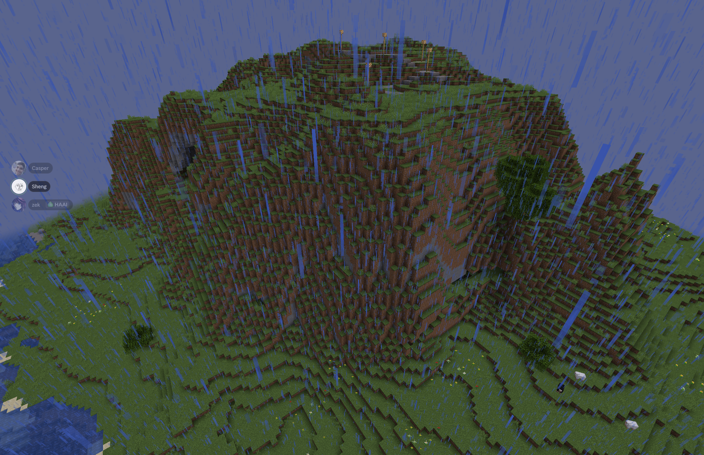
  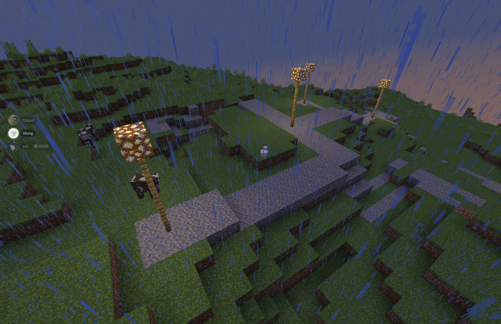
  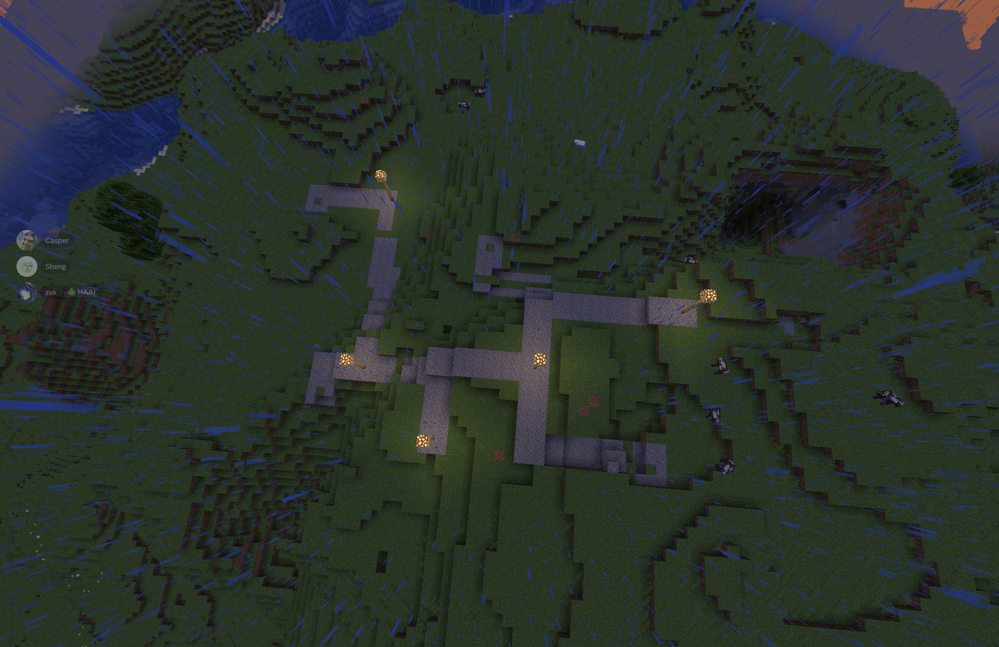

  **Expected Output**: 
  ```
COMPONENT 3: MOUNTAIN WORLD PATHFINDING
Seed is 42

Total plots: 4
Total waypoints: 5

========================================
Step 1: Clearing Obstacles
========================================
  [CLEARING TREES] Using /fill command...
  [CLEARED 36 chunks]
Obstacles cleared!

========================================
Step 2: Preparing Block Cache
========================================
  [CACHE] Initialising block cache...
  [CACHE] Area: (2545, 99, -112) to (2688, 134, 43)
  [CACHE] Allocating 3D array: 144x36x156 = 808704 blocks
  [CACHE] Fetching blocks in bulk... Done!
  [CACHE] Populating cache array... Done!
  [CACHE] Cache ready with 808704 blocks!
Cache ready!

========================================
Step 3: Executing Pathfinding
========================================


========================================
Starting Task C: PathFinding
========================================

Step 1: Connecting waypoints...
Connecting 5 waypoints
  Waypoint 0 at (2612,117,-44) - INVALID
    Attempting to fix waypoint 0...
    Fixed! New position: (2607,115,-49)
  Waypoint 1 at (2608,119,-30) - VALID
  Waypoint 2 at (2615,120,-15) - VALID
  Waypoint 3 at (2630,112,-50) - VALID
  Waypoint 4 at (2600,117,-40) - VALID
Connecting Waypoints 0 to 4
Finding path from (2607,115,-49) to (2600,117,-40)
  Start valid? Yes
  Goal valid? Yes
  Starting Bidirectional BFS loop...
  Iteration 1 | Forward: 1 | Backward: 1
  Iteration 2 | Forward: 4 | Backward: 4
  Iteration 3 | Forward: 6 | Backward: 6
  Iteration 4 | Forward: 8 | Backward: 8
  Iteration 5 | Forward: 8 | Backward: 8
  Iteration 6 | Forward: 8 | Backward: 8
  Iteration 7 | Forward: 10 | Backward: 10
  Iteration 8 | Forward: 10 | Backward: 10
  Iteration 9 | Forward: 10 | Backward: 10
  Iteration 10 | Forward: 12 | Backward: 12
  Iteration 100 | Forward: 32 | Backward: 32
  Paths met at (2607,117,-41)!
  BFS ended after 116 iterations
  Path found with 17 steps
Connecting Waypoints 4 to 1
Finding path from (2600,117,-40) to (2608,119,-30)
  Start valid? Yes
  Goal valid? Yes
  Starting Bidirectional BFS loop...
  Iteration 1 | Forward: 1 | Backward: 1
  Iteration 2 | Forward: 4 | Backward: 4
  Iteration 3 | Forward: 6 | Backward: 6
  Iteration 4 | Forward: 8 | Backward: 8
  Iteration 5 | Forward: 8 | Backward: 8
  Iteration 6 | Forward: 8 | Backward: 8
  Iteration 7 | Forward: 10 | Backward: 10
  Iteration 8 | Forward: 10 | Backward: 10
  Iteration 9 | Forward: 10 | Backward: 10
  Iteration 10 | Forward: 12 | Backward: 12
  Iteration 100 | Forward: 32 | Backward: 32
  Paths met at (2608, 118, -39)!
  BFS ended after 147 iterations
  Path found with 19 steps
Connecting Waypoints 1 to 2
Finding path from (2608,119,-30) to (2615,120,-15)
  Start valid? Yes
  Goal valid? Yes
  Starting Bidirectional BFS loop...
  Iteration 1 | Forward: 1 | Backward: 1
  Iteration 2 | Forward: 4 | Backward: 4
  Iteration 3 | Forward: 6 | Backward: 6
  Iteration 4 | Forward: 8 | Backward: 8
  Iteration 5 | Forward: 8 | Backward: 8
  Iteration 6 | Forward: 8 | Backward: 8
  Iteration 7 | Forward: 10 | Backward: 10
  Iteration 8 | Forward: 10 | Backward: 10
  Iteration 9 | Forward: 10 | Backward: 10
  Iteration 10 | Forward: 12 | Backward: 12
  Iteration 100 | Forward: 32 | Backward: 32
  Iteration 200 | Forward: 42 | Backward: 42
  Paths met at (2615, 119, -26)!
  BFS ended after 229 iterations
  Path found with 23 steps
Connecting Waypoints 0 to 3
Finding path from (2607,115,-49) to (2630,112,-50)
  Start valid? Yes
  Goal valid? Yes
  Starting Bidirectional BFS loop...
  Iteration 1 | Forward: 1 | Backward: 1
  Iteration 2 | Forward: 4 | Backward: 4
  Iteration 3 | Forward: 6 | Backward: 6
  Iteration 4 | Forward: 8 | Backward: 8
  Iteration 5 | Forward: 8 | Backward: 8
  Iteration 6 | Forward: 8 | Backward: 8
  Iteration 7 | Forward: 10 | Backward: 10
  Iteration 8 | Forward: 10 | Backward: 10
  Iteration 9 | Forward: 10 | Backward: 10
  Iteration 10 | Forward: 12 | Backward: 12
  Iteration 100 | Forward: 32 | Backward: 30
  Iteration 200 | Forward: 42 | Backward: 43
  Paths met at (2619, 112, -49)!
  BFS ended after 266 iterations
  Path found with 25 steps
  Building path with 17 segments...
  Path built!
  Building path with 19 segments...
  Path built!
  Building path with 23 segments...
  Path built!
  Building path with 25 segments...
  Path built!
Waypoints connected and Path build!

Step 2: Connecting houses to waypoints...
Connecting house 0 to nearest waypoint...
  House entrance at (2604,115,-54)
  Start point (2 blocks from entrance): (2604,114,-54)
  Connecting to waypoint 0 at (2607,115,-49)
Finding path from (2604,114,-54) to (2607,115,-49)
  Start valid? Yes
  Goal valid? Yes
  Starting Bidirectional BFS loop...
  Iteration 1 | Forward: 1 | Backward: 1
  Iteration 2 | Forward: 4 | Backward: 4
  Iteration 3 | Forward: 6 | Backward: 6
  Iteration 4 | Forward: 8 | Backward: 8
  Iteration 5 | Forward: 8 | Backward: 8
  Iteration 6 | Forward: 8 | Backward: 8
  Iteration 7 | Forward: 10 | Backward: 10
  Iteration 8 | Forward: 10 | Backward: 10
  Iteration 9 | Forward: 10 | Backward: 10
  Iteration 10 | Forward: 12 | Backward: 12
  Paths met at (2607, 114, -53)!
  BFS ended after 27 iterations
  Path found with 9 steps
  Building path with 9 segments...
  Path built!
  ✓ Path built successfully!
Connecting house 1 to nearest waypoint...
  House entrance at (2622,120,-36)
  Start point (2 blocks from entrance): (2622,117,-36)
  Connecting to waypoint 1 at (2608,119,-30)
Finding path from (2622,117,-36) to (2608,119,-30)
  Start valid? Yes
  Goal valid? Yes
  Starting Bidirectional BFS loop...
  Iteration 1 | Forward: 1 | Backward: 1
  Iteration 2 | Forward: 4 | Backward: 4
  Iteration 3 | Forward: 6 | Backward: 6
  Iteration 4 | Forward: 8 | Backward: 8
  Iteration 5 | Forward: 8 | Backward: 8
  Iteration 6 | Forward: 8 | Backward: 8
  Iteration 7 | Forward: 10 | Backward: 10
  Iteration 8 | Forward: 10 | Backward: 10
  Iteration 9 | Forward: 10 | Backward: 10
  Iteration 10 | Forward: 12 | Backward: 12
  Iteration 100 | Forward: 32 | Backward: 32
  Paths met at (2618,116,-30)!
  BFS ended after 182 iterations
  Path found with 21 steps
  Building path with 21 segments...
  Path built!
  ✓ Path built successfully!
Connecting house 2 to nearest waypoint...
  House entrance at (2599,112,-18)
  Start point (2 blocks from entrance): (2599,119,-18)
  Connecting to waypoint 1 at (2608,119,-30)
Finding path from (2599,119,-18) to (2608,119,-30)
  Start valid? Yes
  Goal valid? Yes
  Starting Bidirectional BFS loop...
  Iteration 1 | Forward: 1 | Backward: 1
  Iteration 2 | Forward: 4 | Backward: 4
  Iteration 3 | Forward: 6 | Backward: 6
  Iteration 4 | Forward: 8 | Backward: 8
  Iteration 5 | Forward: 8 | Backward: 8
  Iteration 6 | Forward: 8 | Backward: 8
  Iteration 7 | Forward: 10 | Backward: 10
  Iteration 8 | Forward: 10 | Backward: 10
  Iteration 9 | Forward: 10 | Backward: 10
  Iteration 10 | Forward: 12 | Backward: 12
  Iteration 100 | Forward: 32 | Backward: 32
  Iteration 200 | Forward: 42 | Backward: 42
  Paths met at (2600,119,-28)!
  BFS ended after 204 iterations
  Path found with 22 steps
  Building path with 22 segments...
  Path built!
  ✓ Path built successfully!
Connecting house 3 to nearest waypoint...
  House entrance at (2629,118,-60)
  Start point (2 blocks from entrance): (2629,112,-60)
  Connecting to waypoint 3 at (2630,112,-50)
Finding path from (2629,112,-60) to (2630,112,-50)
  Start valid? Yes
  Goal valid? Yes
  Starting Bidirectional BFS loop...
  Iteration 1 | Forward: 1 | Backward: 1
  Iteration 2 | Forward: 4 | Backward: 4
  Iteration 3 | Forward: 6 | Backward: 6
  Iteration 4 | Forward: 8 | Backward: 8
  Iteration 5 | Forward: 8 | Backward: 8
  Iteration 6 | Forward: 8 | Backward: 8
  Iteration 7 | Forward: 10 | Backward: 10
  Iteration 8 | Forward: 10 | Backward: 10
  Iteration 9 | Forward: 10 | Backward: 10
  Iteration 10 | Forward: 12 | Backward: 12
  Paths met at (2630,112,-55)!
  BFS ended after 59 iterations
  Path found with 12 steps
  Building path with 12 segments...
  Path built!
  ✓ Path built successfully!
Houses connected!

Step 3: Building waypoint structures(lamps)...

========================================
Task C Complete
========================================


========================================
TEST COMPLETE!
========================================

  ```

  **Why This Test Passes**: 
  -Handles extreme height variations (Y range 85-145)
  -Adaptive height checking allows navigation through mountainous terrain
  -Waypoint fixing works in complex terrain to find valid positions
  -House entrances maintain consistent height levels despite terrain
  -Simplified path building prevents complex terrain modification issues
  -Explicit entrance protection prevents gravel blocking on steep slopes
  -Pathfinding successfully navigates around mountain obstacles
  -All connections maintain proper height alignment
  -Waypoint structures adapt to varying terrain heights


  # Example Test:
  ## Task B Subdividing Building:
  **Test 1**: Normal Usage:
  **Description**: Testing a normal use case for recursive subdivision.
  **Setup**: loc=123,123 village-size=50, plot-border=10, seed=1, testmode
  (123,123) should be within superflat terrain, to ensure no environmental disruptions.
  **Expected output**
  XXXXXXXXXXXXXXXXXXXXX
  X    X    X    X    X
  X    .    .    .    X
  X    X    X    X    X
  X    X    X    X    X
  XXX.XXXX.XXXX.XXXX.XX
  X    X    X    X    X
  X    X    X    X    X
  X    X    X    X    X
  X    X    X    X    X
  XXX.XXXX.XXXX.XXXX.XX
  X    X    X    X    X
  X    X    X    X    X
  X    X    X    X    X
  X    X    X    X    X
  XXX.XXXX.XXXX.XXXX.XX
  X    X    X    X    X
  X    .    .    .    X
  X    X    X    X    X
  X    X    X    X    X
  XXXXXXXXXXXXXXXXXXXXX
